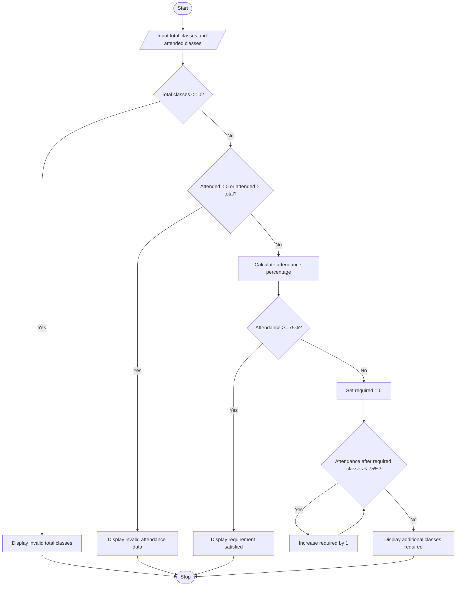

# Case Study 12: Attendance Recovery Computation

```mermaid
flowchart TD
    A([Start]) --> B[/Input total classes and attended classes/]
    B --> C{Total classes <= 0?}
    C -- Yes --> D[Display invalid total classes]
    D --> Z([Stop])
    C -- No --> E{Attended < 0 or attended > total?}
    E -- Yes --> F[Display invalid attendance data]
    F --> Z
    E -- No --> G[Calculate attendance percentage]
    G --> H{Attendance >= 75%?}
    H -- Yes --> I[Display requirement satisfied]
    I --> Z
    H -- No --> J[Set required = 0]
    J --> K{Attendance after required classes < 75%?}
    K -- Yes --> L[Increase required by 1]
    L --> K
    K -- No --> M[Display additional classes required]
    M --> Z
```