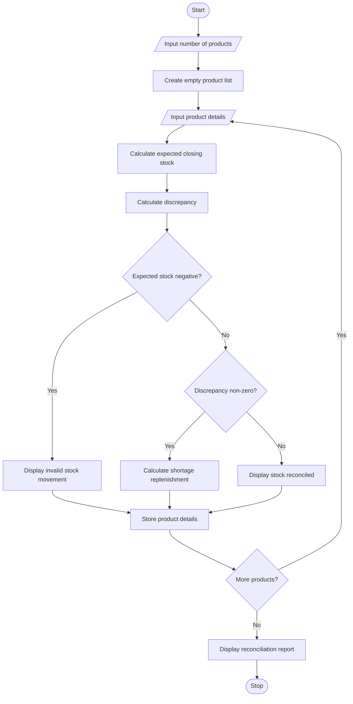

# Case Study 14: Warehouse Inventory Reconciliation

```mermaid
flowchart TD
    A([Start]) --> B[/Input number of products/]
    B --> C[Create empty product list]
    C --> D[/Input product details/]
    D --> E[Calculate expected closing stock]
    E --> F[Calculate discrepancy]
    F --> G{Expected stock negative?}
    G -- Yes --> H[Display invalid stock movement]
    G -- No --> I{Discrepancy non-zero?}
    I -- Yes --> J[Calculate shortage replenishment]
    I -- No --> K[Display stock reconciled]
    H --> L[Store product details]
    J --> L
    K --> L
    L --> M{More products?}
    M -- Yes --> D
    M -- No --> N[Display reconciliation report]
    N --> O([Stop])
```