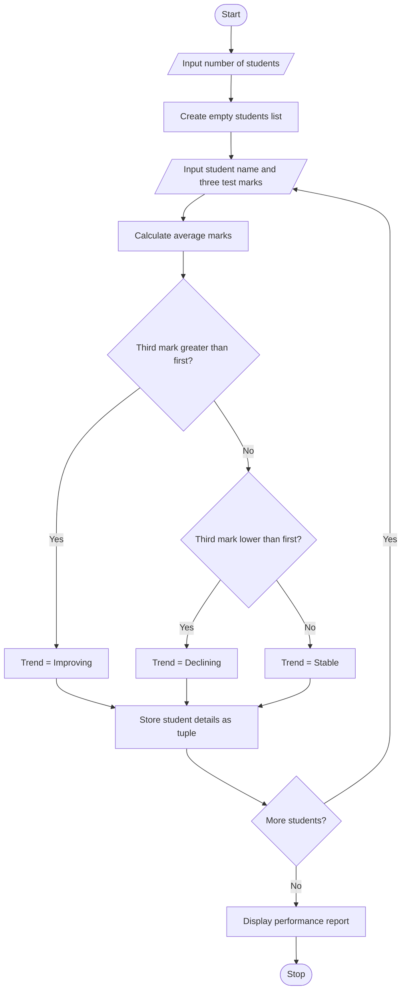

# Case Study 17: Student Performance Trend Analysis

```mermaid
flowchart TD
    A([Start]) --> B[/Input number of students/]
    B --> C[Create empty students list]
    C --> D[/Input student name and three test marks/]
    D --> E[Calculate average marks]
    E --> F{Third mark greater than first?}
    F -- Yes --> G[Trend = Improving]
    F -- No --> H{Third mark lower than first?}
    H -- Yes --> I[Trend = Declining]
    H -- No --> J[Trend = Stable]
    G --> K[Store student details as tuple]
    I --> K
    J --> K
    K --> L{More students?}
    L -- Yes --> D
    L -- No --> M[Display performance report]
    M --> N([Stop])
```