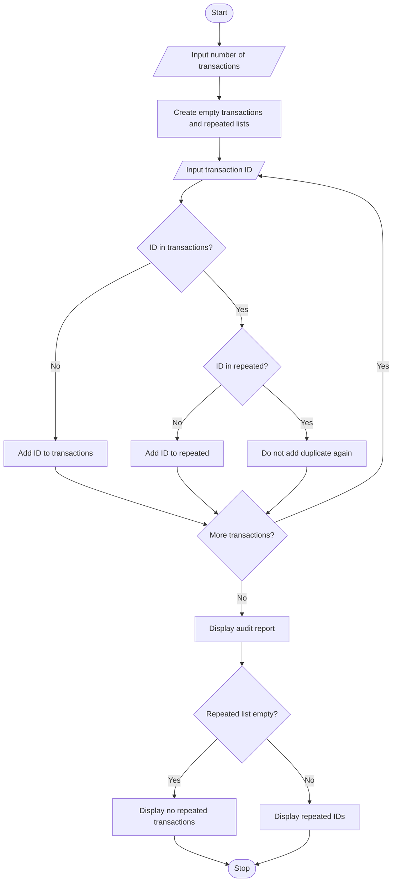

# Case Study 28: Repeated Transaction Detection

```mermaid
flowchart TD
    A([Start]) --> B[/Input number of transactions/]
    B --> C[Create empty transactions and repeated lists]
    C --> D[/Input transaction ID/]
    D --> E{ID in transactions?}
    E -- No --> F[Add ID to transactions]
    E -- Yes --> G{ID in repeated?}
    G -- No --> H[Add ID to repeated]
    G -- Yes --> I[Do not add duplicate again]
    F --> J{More transactions?}
    H --> J
    I --> J
    J -- Yes --> D
    J -- No --> K[Display audit report]
    K --> L{Repeated list empty?}
    L -- Yes --> M[Display no repeated transactions]
    L -- No --> N[Display repeated IDs]
    M --> O([Stop])
    N --> O
```