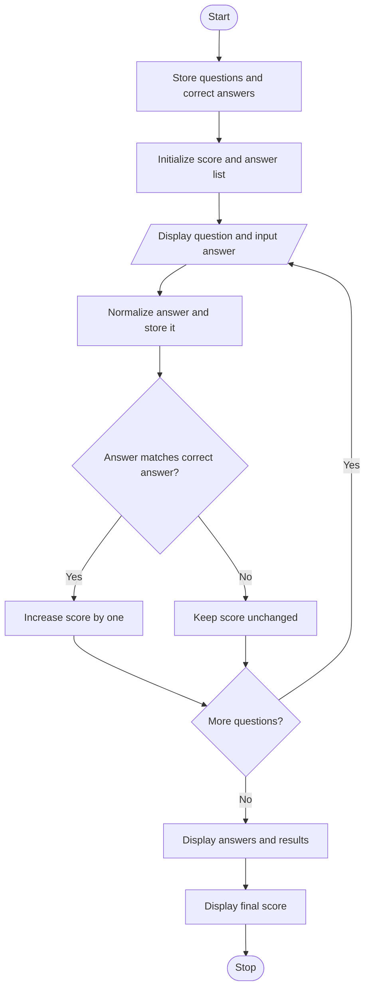

# Case Study 31: String-Based Examination Answer Evaluation

```mermaid
flowchart TD
    A([Start]) --> B[Store questions and correct answers]
    B --> C[Initialize score and answer list]
    C --> D[/Display question and input answer/]
    D --> E[Normalize answer and store it]
    E --> F{Answer matches correct answer?}
    F -- Yes --> G[Increase score by one]
    F -- No --> H[Keep score unchanged]
    G --> I{More questions?}
    H --> I
    I -- Yes --> D
    I -- No --> J[Display answers and results]
    J --> K[Display final score]
    K --> L([Stop])
```