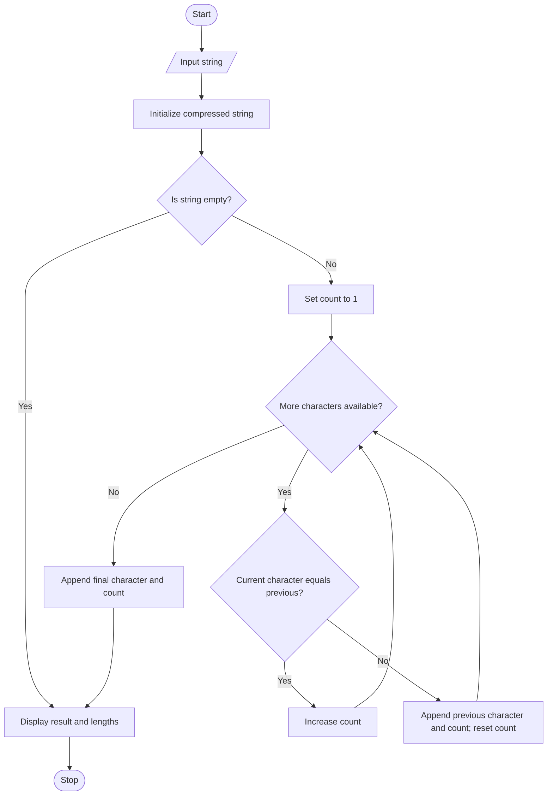

# Case Study 35: Text Compression Using Character Runs

```mermaid
flowchart TD
    A([Start]) --> B[/Input string/]
    B --> C[Initialize compressed string]
    C --> D{Is string empty?}
    D -- Yes --> K[Display result and lengths]
    D -- No --> E[Set count to 1]
    E --> F{More characters available?}
    F -- Yes --> G{Current character equals previous?}
    G -- Yes --> H[Increase count]
    G -- No --> I[Append previous character and count; reset count]
    H --> F
    I --> F
    F -- No --> J[Append final character and count]
    J --> K
    K --> L([Stop])
```