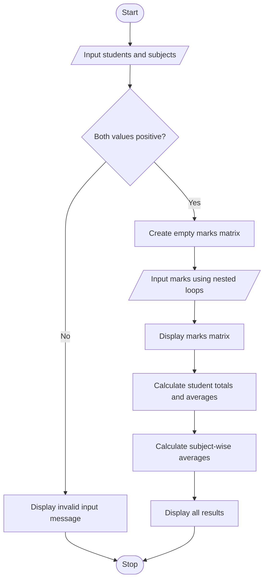

# Case Study 42: Student Marks Matrix Analysis

```mermaid id="z2x7mf"
flowchart TD
    A([Start]) --> B[/Input students and subjects/]
    B --> C{Both values positive?}
    C -- No --> D[Display invalid input message]
    D --> Z([Stop])
    C -- Yes --> E[Create empty marks matrix]
    E --> F[/Input marks using nested loops/]
    F --> G[Display marks matrix]
    G --> H[Calculate student totals and averages]
    H --> I[Calculate subject-wise averages]
    I --> J[Display all results]
    J --> Z
```