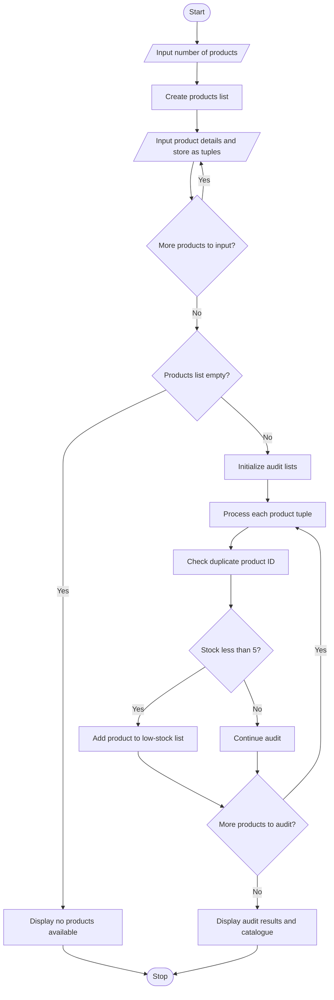

# Case Study 49: Tuple-Based Product Catalogue Audit

```mermaid id="j8k2mn"
flowchart TD
    A([Start]) --> B[/Input number of products/]
    B --> C[Create products list]
    C --> D[/Input product details and store as tuples/]
    D --> E{More products to input?}
    E -- Yes --> D
    E -- No --> F{Products list empty?}
    F -- Yes --> G[Display no products available]
    G --> Z([Stop])
    F -- No --> H[Initialize audit lists]
    H --> I[Process each product tuple]
    I --> J[Check duplicate product ID]
    J --> K{Stock less than 5?}
    K -- Yes --> L[Add product to low-stock list]
    K -- No --> M[Continue audit]
    L --> N{More products to audit?}
    M --> N
    N -- Yes --> I
    N -- No --> O[Display audit results and catalogue]
    O --> Z
```