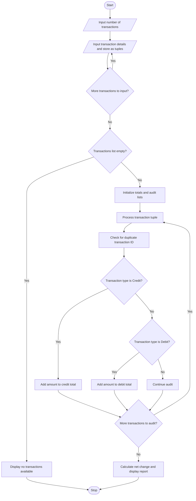

# Case Study 55: Tuple-Based Transaction Audit

```mermaid id="n3r7qt"
flowchart TD
    A([Start]) --> B[/Input number of transactions/]
    B --> C[/Input transaction details and store as tuples/]
    C --> D{More transactions to input?}
    D -- Yes --> C
    D -- No --> E{Transactions list empty?}
    E -- Yes --> F[Display no transactions available]
    F --> Z([Stop])
    E -- No --> G[Initialize totals and audit lists]
    G --> H[Process transaction tuple]
    H --> I[Check for duplicate transaction ID]
    I --> J{Transaction type is Credit?}
    J -- Yes --> K[Add amount to credit total]
    J -- No --> L{Transaction type is Debit?}
    L -- Yes --> M[Add amount to debit total]
    L -- No --> N[Continue audit]
    K --> O{More transactions to audit?}
    M --> O
    N --> O
    O -- Yes --> H
    O -- No --> P[Calculate net change and display report]
    P --> Z
```