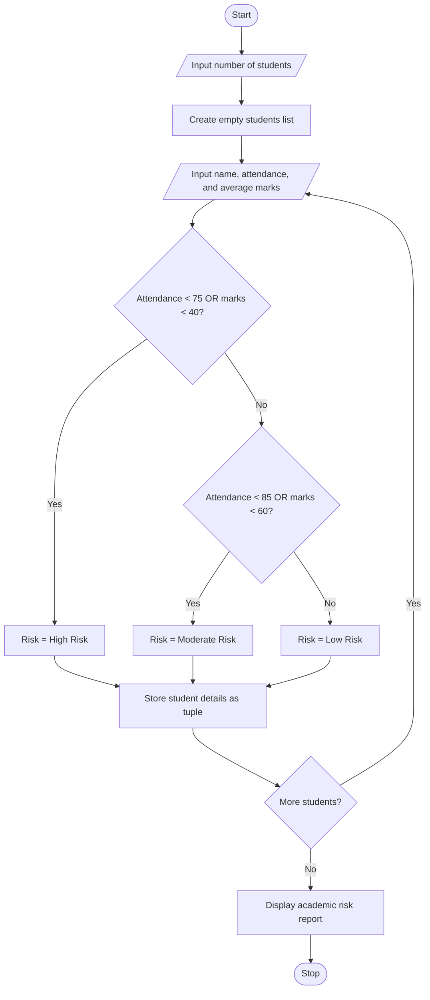

# Case Study 66: Student Academic Risk Classification

```mermaid
flowchart TD
    A([Start]) --> B[/Input number of students/]
    B --> C[Create empty students list]
    C --> D[/Input name, attendance, and average marks/]
    D --> E{Attendance < 75 OR marks < 40?}
    E -- Yes --> F[Risk = High Risk]
    E -- No --> G{Attendance < 85 OR marks < 60?}
    G -- Yes --> H[Risk = Moderate Risk]
    G -- No --> I[Risk = Low Risk]
    F --> J[Store student details as tuple]
    H --> J
    I --> J
    J --> K{More students?}
    K -- Yes --> D
    K -- No --> L[Display academic risk report]
    L --> M([Stop])
```